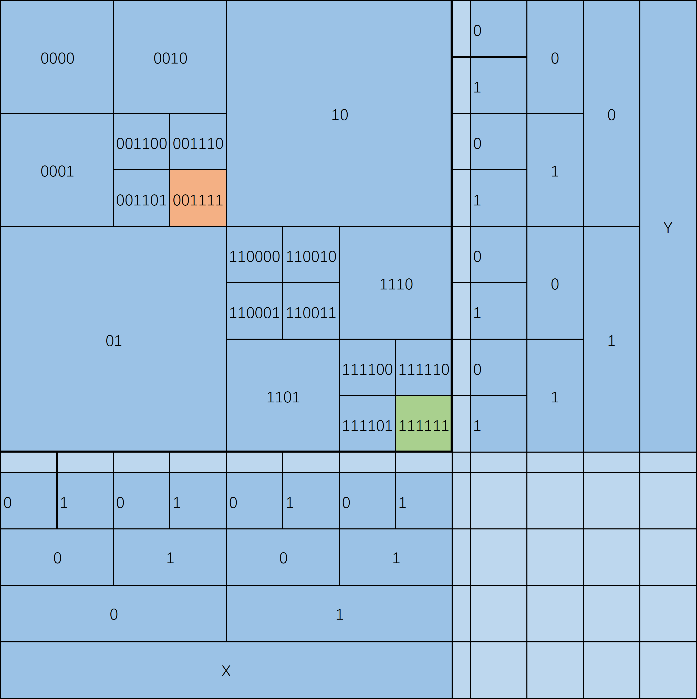

# 四叉树

## 插入

## 删除

## 查找

### 码点分配

``` text
1 0      01 00
2 3  =>  10 11
```

<!--  -->


任意节点可按此编码
e.g.1
图中橙色格子可编码为`00` `11` `11`, 坐标形式`(011, 011)`
对其`x` `y`坐标上下浮动1，即可得出`3 * 3 - 1 = 8`个相邻格子(不含自身)

- `(100, 100)` `110000` `✔`
- `(100, 011)` `100101` `未分裂，属于01****`
- `(100, 010)` `100100` `未分裂，属于10****`
- `(011, 100)` `011010` `未分裂，属于01****`
- `(011, 011)` `001111` `自身`
- `(011, 010)` `001110` `✔`
- `(010, 100)` `011000` `未分裂，属于01****`
- `(010, 011)` `001101` `✔`
- `(010, 010)` `001100` `✔`

e.g.2
图中绿色格子可编码为`11` `11` `11`, 坐标形式`(111, 111)`

- `(110, 110)` `111100` `✔`
- `(110, 111)` `111101` `✔`
- `(110, ***)` `******` `溢出`
- `(111, 110)` `111110` `✔`
- `(111, 111)` `111111` `自身`
- `(111, ***)` `******` `溢出`
- `(***, 110)` `******` `溢出`
- `(***, 111)` `******` `溢出`
- `(***, ***)` `******` `溢出`
